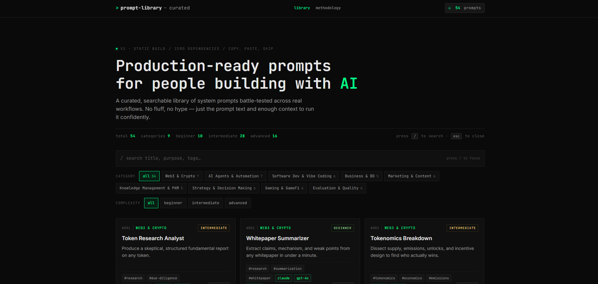

<div align="center">

# prompt-library

**Production-ready prompts for people building with AI.**

A fast, dark, searchable library of system prompts — battle-tested across
real workflows. Zero dependencies. Zero build step. Three files, one
browser tab.

</div>

---

## Live site

**→ https://sarutobisasuke8.github.io/testing/** *(active after GitHub Pages is enabled — see [Deploy](#deploy))*

## Screenshot



*Placeholder — drop a real PNG here at `prompt-library/screenshot.png` after
first deploy. Ideally a wide shot showing the grid with a modal open.*

---

## What it does

- **Curated.** Every prompt is tested, scoped, and opinionated. Not a
  content farm.
- **Searchable.** Live keyword search across title, purpose, and tags.
- **Filterable.** Nine categories × three complexity levels. Counts update live.
- **Copy-first.** One tap on any card grabs the prompt. No open-modal tax.
- **Readable.** Click a card to see the full system prompt, metadata,
  chaining suggestions, and author notes.
- **Mobile-first.** Designed on a phone. Works on a phone.
- **Forkable.** 3 files, ~20 minutes to read end-to-end. Take it, reshape it,
  ship your own version.

---

## Why it exists

Every AI builder keeps a private scratchpad of prompts that actually work —
the ones they trust enough to use on a Monday morning. Those prompts rarely
leave the scratchpad.

This is a place to publish the good ones, with enough structure to make them
findable and enough curation to keep the signal high.

Not a prompt marketplace. Not a content farm. A library.

---

## Categories

Each category is data-driven: adding a new one is a one-line change in
`prompts.js`. No UI edits needed.

| Key            | Name                           | Examples                                         |
|----------------|--------------------------------|--------------------------------------------------|
| `web3`         | Web3 & Crypto                  | Token research analyst, tokenomics breakdown, sybil detector |
| `agents`       | AI Agents & Automation         | Research agent, RAG optimizer, tool-use scaffold |
| `vibe-coding`  | Software Dev & Vibe Coding     | Debugging partner, code review, refactor guide   |
| `business`     | Business & BD                  | Partnership outreach, cold email, stakeholder updates |
| `marketing`    | Marketing & Content            | X thread generator, newsletter, announcement writer |
| `pkm`          | Knowledge Management & PKM     | Obsidian notes, meeting → actions, second-brain query |
| `strategy`     | Strategy & Decision Making     | Decision framework, investment memo, scenario planner |
| `gaming`       | Gaming & GameFi                | Guild management, player scoring, economy analyzer |
| `evaluation`   | Evaluation & Quality           | Output scorer, hallucination detector, red-teamer |

---

## Tech stack

Chosen deliberately. See [`CLAUDE.md`](./CLAUDE.md) for why each constraint matters.

| Layer        | Choice                           | Notes                                |
|--------------|----------------------------------|--------------------------------------|
| HTML         | `index.html`                     | App shell + inline runtime JS        |
| Styles       | `style.css`                      | Tokens via CSS variables             |
| Data         | `prompts.js`                     | Plain JS — `CATEGORIES` + `PROMPTS`  |
| Capture tool | `add-prompt.html`                | Local-only form → JSON output        |
| Hosting      | GitHub Pages                     | Free, CDN-backed, static             |
| CI/CD        | GitHub Actions                   | Deploys on push to `main`            |
| Fonts        | JetBrains Mono + Inter           | Loaded from Google Fonts             |

**No** React. **No** Tailwind. **No** npm. **No** bundler. **No** backend.

---

## Design

```
background   #0a0a0a   near-black, not the cliché #000
accent       #00ff88   electric green — used sparingly
text         #e6e6e6   off-white
text-dim     #9a9a9a   metadata, labels
radius       2px       nearly-square, technical
font/mono    JetBrains Mono
font/sans    Inter
```

No gradients. No glow effects. No generic AI purple. Sharp, minimal,
technical. If it looks like a crypto terminal from 2027, it's working.

---

## Keyboard shortcuts

| Key     | Action                      |
|---------|-----------------------------|
| `/`     | Focus the search input      |
| `Esc`   | Close the open modal        |
| `Enter` / `Space` on a card | Open its modal |
| `Tab`   | Navigate cards / controls   |

---

## Quickstart

### Just browse locally

```bash
git clone https://github.com/sarutobisasuke8/testing.git
cd testing/prompt-library
# Open index.html in your browser. That's it. No install. No serve.
```

*(Or `python3 -m http.server 8000` if you prefer `http://localhost:8000` over
`file://` — both work.)*

### Add a prompt

**Option A — the form (2 min per prompt):**

1. Open `add-prompt.html` in your browser (local file, red banner means
   you're in the right place)
2. Fill the fields → **Generate JSON** → **Copy**
3. Paste into `prompts.js` inside the `PROMPTS` array
4. Refresh `index.html` to see the new card

**Option B — by hand:**

Edit `prompts.js` directly. Copy an existing entry, bump the `id`, swap the
fields. Multi-line prompts use the `"line1\n" +\n"line2"` pattern shown in
existing entries.

Full schema and quality bar: [`CONTRIBUTING.md`](./CONTRIBUTING.md).

---

## Prompt schema

```js
{
  id:          1,                               // unique integer
  title:       "Token Research Analyst",        // short, no hype
  category:    "web3",                          // key from CATEGORIES
  complexity:  "intermediate",                  // beginner | intermediate | advanced
  purpose:     "One-line description.",
  tags:        ["research", "due-diligence"],   // lowercase, 2–5
  models:      ["claude", "gpt-4o"],            // actually tested
  temperature: "0.3",                           // string
  prompt:      "You are a ...",                 // full system prompt
  chaining:    "Pair with X to ...",            // optional
  notes:       "Works best when ..."            // optional
}
```

---

## Quality bar

A prompt belongs here if it:

- Solves a specific, real problem somebody actually has
- Produces **structured, predictable** output (defines the shape of its answer)
- Has been tested against at least one listed model
- States its own limits (notes field)
- Could be shown to a sceptical senior engineer without embarrassment

A prompt does **not** belong here if it:

- Uses shill language ("revolutionary", "game-changing", "cutting-edge")
- Is a generic reformatted "write me a blog post"
- Makes claims the model can't deliver ("always factually correct")
- Was never actually tested
- Contains private data, client info, or unredacted credentials

Curation is active. Not every PR will merge.

---

## Deploy

The site deploys automatically via GitHub Actions on every push to `main`
that touches `prompt-library/**`.

### One-time setup (in the GitHub UI)

1. Push to `main`, merge this branch
2. Repo → **Settings → Pages**
3. Under **Build and deployment → Source**, select **GitHub Actions**
4. The first workflow run publishes to the URL shown in the run's logs

### Workflow

See [`.github/workflows/deploy.yml`](../.github/workflows/deploy.yml) at the
**repo root** (not inside this folder). It uploads only the `prompt-library/`
subdirectory as the Pages artifact. The rest of the containing repo is
unrelated tooling. If this project ever moves to its own dedicated repo,
change the single `path` line — see the comment inside the workflow.

---

## Project docs

- [`CLAUDE.md`](./CLAUDE.md) — dev-facing project context. Read this before
  making non-trivial changes.
- [`CONTRIBUTING.md`](./CONTRIBUTING.md) — schema, quality bar, PR flow.
- [`ROADMAP.md`](./ROADMAP.md) — what's next, what's parked, and the
  triggers for moving off the static architecture.

---

## Roadmap, in one paragraph

v1 is a **static, read-only, curated library.** Ship it first. Get users.
See what they actually ask for. v2 adds the community layer — likes,
profiles, folders, ratings — but every one of those requires a backend,
auth, moderation, and a hosting tier that isn't free GitHub Pages. Don't
build v2 until the signal is real. Full detail: [`ROADMAP.md`](./ROADMAP.md).

---

## Contributing

Yes please. Better with more eyes on it.

**[→ Read CONTRIBUTING.md](./CONTRIBUTING.md)** for the schema, the quality
bar, the `add-prompt.html` flow, and the PR checklist.

PRs land on `main`; the workflow redeploys the site automatically.

---

## FAQ

**Why not React / Next / SvelteKit?**
Because none of this justifies the bundle. A library of text with search is
a textbook case where vanilla JS wins on speed, readability, and longevity.

**Why no database?**
A curated library doesn't need one. When it does (likes, users, folders),
that's the v2 trigger. Until then, `prompts.js` is the "database" and `git
log` is the change history.

**Why the red banner on `add-prompt.html`?**
So it's never confused with the live site. It's a local dev tool that
happens to be HTML.

**Can I fork and run my own?**
Yes. That's the point. MIT.

**Can I submit a prompt anonymously?**
Through a PR, you'll appear in the commit log. If that's a blocker, open an
issue with the prompt text and we'll land it on your behalf.

---

## License

MIT — use it, fork it, remix it. Attribution appreciated but not required.

---

<div align="center">

*Built for people shipping with AI.*

</div>
